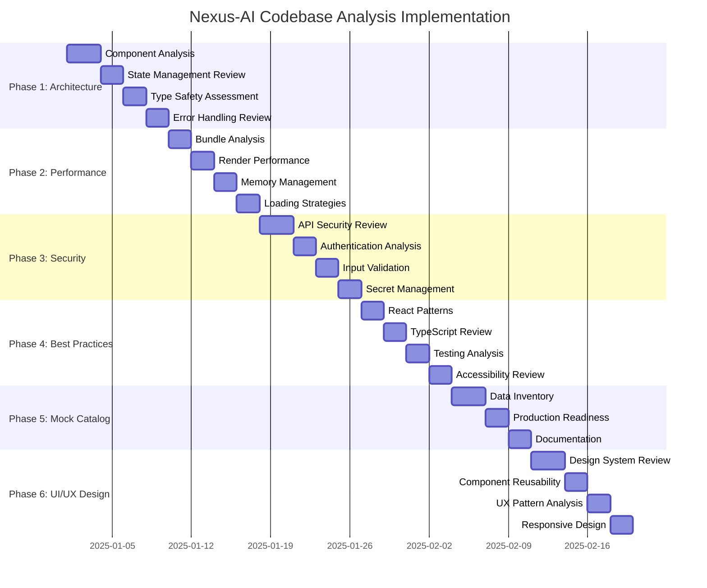

# Comprehensive Nexus-AI Codebase Analysis Plan

## Executive Summary

The Nexus-AI project is a sophisticated React/TypeScript AI chat application with multiple provider integrations, document processing capabilities, and a comprehensive testing infrastructure. This analysis plan identifies significant opportunities for improvement across architecture, security, performance, UI/UX design systems, and production readiness for deployment within 3-6 months.

## Project Context Summary

**Technology Stack:**
- React 18.2.0 + TypeScript with Vite build system
- Express.js server with JWT authentication
- Multiple AI provider integrations (OpenAI, Anthropic, Google, Groq, Mistral, HuggingFace)
- Zustand for state management
- Tailwind CSS + Radix UI components
- LibSQL database with comprehensive testing (Jest + MSW)

**Key Findings from Initial Assessment:**
- 273+ instances of API key/authentication references requiring security review
- Extensive mock data and placeholder systems throughout codebase
- Well-structured component architecture with optimization opportunities
- Comprehensive testing infrastructure with MSW integration
- Advanced features like streaming responses, document processing, and worker threads

## Analysis Framework

```mermaid
graph TD
    A[Codebase Analysis] --> B[Code Quality Assessment]
    A --> C[Performance Analysis]
    A --> D[Security Review]
    A --> E[Best Practices Compliance]
    A --> F[Mock/Placeholder Catalog]
    A --> G[UI/UX & Design Systems]
    
    B --> B1[Architecture Patterns]
    B --> B2[Type Safety]
    B --> B3[Error Handling]
    B --> B4[Component Structure]
    
    C --> C1[Bundle Analysis]
    C --> C2[Render Performance]
    C --> C3[Memory Usage]
    C --> C4[Loading Strategies]
    
    D --> D1[API Security]
    D --> D2[Authentication]
    D --> D3[Data Validation]
    D --> D4[Secret Management]
    
    E --> E1[React Patterns]
    E --> E2[TypeScript Usage]
    E --> E3[Testing Coverage]
    E --> E4[Accessibility]
    
    F --> F1[Mock Data Inventory]
    F --> F2[Placeholder Content]
    F --> F3[Demo User Systems]
    F --> F4[Test Fixtures]
    
    G --> G1[Design System Analysis]
    G --> G2[Component Reusability]
    G --> G3[UI Patterns & Consistency]
    G --> G4[User Experience Flow]
```

## Detailed Analysis Phases

### Phase 1: Architecture & Code Quality Assessment

**Objective**: Evaluate overall system design and identify structural improvements

**Key Focus Areas:**
- **Component Architecture**: Analyze React component hierarchy, prop drilling, and composition patterns
- **State Management**: Review Zustand store patterns, data flow, and state normalization
- **Type Safety**: Assess TypeScript usage, type coverage, and schema validation with Zod
- **Error Handling**: Evaluate error boundaries, API error handling, and user feedback patterns
- **Code Organization**: Review module structure, dependency management, and separation of concerns

**Specific Analysis Points:**
- Component coupling analysis across src/components hierarchy
- Zustand store structure in src/store (4 identified stores)
- TypeScript strict mode compliance and type coverage
- Error boundary implementation and API error handling patterns
- Module dependency graph and circular dependency detection

**Expected Findings:**
- Component coupling and reusability opportunities
- State management optimization potential
- Type safety gaps and improvements
- Error handling inconsistencies

### Phase 2: Performance Analysis

**Objective**: Identify performance bottlenecks and optimization opportunities

**Key Focus Areas:**
- **Bundle Size Analysis**: Evaluate code splitting, lazy loading, and tree shaking effectiveness
- **Render Performance**: Identify unnecessary re-renders and optimization opportunities
- **Memory Management**: Assess memory leaks, cleanup patterns, and resource management
- **Loading Strategies**: Review async operations, streaming implementations, and user experience
- **Database Operations**: Analyze query patterns and data fetching strategies

**Specific Analysis Points:**
- Vite bundle analysis and code splitting opportunities
- React.memo, useMemo, useCallback usage patterns
- WebWorker implementation in src/workers
- Streaming response handling in AI providers
- LibSQL query optimization and connection management

**Expected Findings:**
- Bundle optimization opportunities (currently includes 6 AI provider SDKs)
- React performance improvements
- Memory usage optimizations
- Database query efficiency improvements

### Phase 3: Security Review

**Objective**: Identify security vulnerabilities and implement security best practices

**Key Focus Areas:**
- **API Security**: Review API key management, request validation, and rate limiting
- **Authentication System**: Assess JWT handling, session management, and authorization patterns
- **Input Validation**: Evaluate data sanitization, XSS prevention, and injection attack protection
- **Secret Management**: Review environment variable usage and secure storage patterns
- **Client-Side Security**: Assess CSP implementation, secure headers, and data exposure

**Specific Analysis Points:**
- 273+ API key references across codebase requiring secure storage review
- JWT implementation in src/lib/auth/auth.ts with hardcoded secret
- Input sanitization using DOMPurify and Zod validation
- Environment variable handling in src/config/env.ts
- Express server security headers and CORS configuration

**Expected Findings:**
- API key exposure risks (high priority)
- Authentication system improvements
- Input validation gaps
- Security header configurations

### Phase 4: Best Practices Compliance

**Objective**: Ensure adherence to modern React/TypeScript development standards

**Key Focus Areas:**
- **React Patterns**: Evaluate hook usage, component patterns, and lifecycle management
- **TypeScript Implementation**: Assess type definitions, generics usage, and strict mode compliance
- **Testing Strategy**: Review test coverage, testing patterns, and mock implementations
- **Accessibility Compliance**: Evaluate WCAG compliance, keyboard navigation, and screen reader support
- **Code Style**: Review ESLint/Prettier configurations and code consistency

**Specific Analysis Points:**
- Custom hooks implementation and reusability
- TypeScript configuration across 3 tsconfig files
- Jest test coverage (current setup with MSW)
- Radix UI accessibility compliance
- ESLint/Prettier configuration effectiveness

**Expected Findings:**
- React pattern improvements
- TypeScript strict mode opportunities
- Testing coverage gaps
- Accessibility improvements

### Phase 5: Mock Data & Placeholder Catalog

**Objective**: Systematically identify and catalog all non-production content

**Key Focus Areas:**
- **Mock Data Inventory**: Catalog all test data, demo content, and placeholder values
- **Authentication Placeholders**: Identify demo users, test credentials, and mock auth systems
- **API Mocking**: Review MSW handlers, test fixtures, and development data
- **UI Placeholders**: Identify placeholder text, demo content, and temporary UI elements
- **Development Utilities**: Catalog development-only code and temporary workarounds

**Specific Analysis Points:**
- MSW handlers in src/test/mocks/ (extensive mock API implementation)
- Demo user systems in authentication (DEFAULT_USER_ID = 'demo-user')
- Mock AI providers for testing
- Placeholder content in UI components
- Development-only environment configurations

**Current Findings Summary:**
- 273+ instances of API key/authentication references
- Extensive MSW mock implementation with complete API coverage
- Demo user systems throughout authentication layer
- Placeholder content in UI components and test fixtures
- Development-only utilities and helpers

### Phase 6: UI/UX & Design Systems Analysis

**Objective**: Evaluate design consistency, component reusability, and user experience patterns

**Key Focus Areas:**
- **Design System Analysis**: Review component library structure, theming, and consistency
- **Component Reusability**: Assess component composition, props APIs, and extensibility
- **UI Patterns & Consistency**: Evaluate design patterns, spacing, typography, and visual hierarchy
- **User Experience Flow**: Analyze user journeys, interaction patterns, and accessibility
- **Responsive Design**: Review mobile compatibility and adaptive layouts

**Specific Analysis Points:**
- Radix UI component usage and customization patterns
- Tailwind CSS design system implementation and theme configuration
- Component composition in src/components/ui/ (identified 15+ base components)
- Design token consistency and spacing system
- Dark/light theme implementation with next-themes
- Mobile responsiveness and touch interaction patterns
- Loading states and user feedback mechanisms
- Navigation patterns and information architecture

**Expected Findings:**
- Design system consolidation opportunities
- Component API standardization needs
- Responsive design improvements
- User experience optimization areas
- Accessibility enhancement requirements

## Implementation Roadmap

## Analysis Methodology

**Systematic Code Examination:**
1. **Static Analysis**: Use AST parsing and pattern matching to identify code patterns
2. **Dynamic Analysis**: Review runtime behavior and performance characteristics  
3. **Dependency Analysis**: Evaluate third-party library usage and security
4. **Test Coverage Analysis**: Assess test quality and coverage gaps
5. **Documentation Review**: Evaluate code documentation and inline comments

**Tools and Techniques:**
- File system traversal for comprehensive coverage
- Regex pattern matching for specific issues (security, mocks, TODOs)
- Code definition analysis for architectural understanding
- Cross-reference analysis for dependency mapping
- Component tree analysis for UI/UX patterns

**Specific Focus Areas by File Structure:**
- `src/components/`: UI component analysis and design system review
- `src/lib/`: Core business logic and utility function assessment
- `src/store/`: State management pattern evaluation
- `src/types/`: TypeScript type system analysis
- `src/test/`: Testing strategy and mock implementation review

## Expected Deliverables

### 1. Comprehensive Analysis Report
- **Executive Summary**: High-level findings and recommendations
- **Detailed Findings**: Categorized by severity and impact with specific file references
- **Code Examples**: Specific instances with file paths and line numbers
- **Metrics Dashboard**: Quantified improvement opportunities
- **Priority Matrix**: Issues categorized by impact vs implementation effort

### 2. Mock/Placeholder Inventory
- **Complete Catalog**: All mock data, placeholders, and demo content with exact locations
- **Location Mapping**: Exact file paths and line numbers for each instance
- **Categorization**: Grouped by type (authentication, API, UI, test data)
- **Production Roadmap**: Step-by-step replacement plan with dependencies

### 3. Design System & Component Analysis
- **Component Inventory**: Complete catalog of reusable components and their APIs
- **Design Token Analysis**: Color, spacing, typography consistency evaluation
- **UI Pattern Documentation**: Common patterns and inconsistencies
- **Reusability Assessment**: Component composition and extensibility opportunities
- **Accessibility Audit**: WCAG compliance gaps and improvement recommendations

### 4. Prioritized Improvement Roadmap
- **Critical Issues**: Security vulnerabilities and production blockers
- **High Impact**: Performance improvements and architectural enhancements
- **Medium Priority**: Code quality, UI/UX improvements, and maintainability
- **Low Priority**: Nice-to-have optimizations and refactoring

### 5. Implementation Guidelines
- **Best Practices**: Recommended patterns and approaches for each area
- **Migration Strategies**: Safe upgrade paths for major changes
- **Testing Requirements**: Quality assurance for each improvement
- **Timeline Estimates**: Realistic implementation timeframes
- **Success Metrics**: KPIs to measure improvement effectiveness

## Risk Assessment & Mitigation

**High-Risk Areas Identified:**
1. **Security**: 273+ API key references requiring immediate attention
2. **Authentication**: Demo user systems need production-ready replacement
3. **Performance**: Multiple AI provider bundles may impact load times
4. **Data Management**: Mock data systems require production data strategy

**Mitigation Strategies:**
- Prioritize security improvements in first implementation phase
- Implement gradual migration from mock to production systems
- Establish clear testing protocols for each change
- Create rollback procedures for critical system modifications

## Success Criteria

**Analysis Phase Success Metrics:**
- 100% file coverage across all source directories
- Categorized findings with severity and impact ratings
- Specific file paths and line numbers for all identified issues
- Actionable recommendations with implementation estimates
- Complete mock/placeholder inventory ready for production replacement

**Production Readiness Goals:**
- Zero exposed API keys or authentication secrets
- All demo/mock systems replaced with production equivalents
- Performance benchmarks established and optimized
- Comprehensive test coverage for critical paths
- Accessibility compliance verified
- Design system documented and consistent

This comprehensive analysis will provide the foundation for transforming Nexus-AI from a development prototype into a production-ready application within your 3-6 month timeline, with particular emphasis on creating a robust, reusable design system and component library.