# Nexus-AI Phase 1 Technical Report Creation Plan

## Executive Summary

This document outlines the comprehensive plan for creating the **nexus-ai-phase1-technical-report.md** that synthesizes findings from all 5 completed analysis areas into a unified production readiness assessment. The report will consolidate technical findings, provide actionable recommendations, and establish a clear roadmap for achieving production-ready status within 3-6 months.

## Project Context

**Completed Analysis Areas:**
1. **Component Architecture Analysis** - Score: 8.5/10 Excellent
2. **State Management Review** - Sophisticated patterns with ~1,300 lines duplication
3. **Type Safety Assessment** - Score: C+ 63% with 33 critical 'any' instances
4. **Error Handling Review** - Score: C+ 68/100 with coverage gaps
5. **Code Organization Analysis** - Score: B+ 76.25/100 with 3 critical circular dependencies

## Report Synthesis Strategy

```mermaid
graph TD
    A[Phase 1 Technical Report Creation] --> B[Executive Summary Synthesis]
    A --> C[Detailed Findings Consolidation]
    A --> D[Critical Issues Registry]
    A --> E[Production Readiness Roadmap]
    A --> F[Metrics Dashboard]
    A --> G[Implementation Recommendations]
    
    B --> B1[Overall Production Readiness Assessment]
    B --> B2[Key Metrics Summary]
    B --> B3[Go/No-Go Recommendations]
    
    C --> C1[Component Architecture: 8.5/10 Excellent]
    C --> C2[State Management: ~1,300 lines duplication]
    C --> C3[Type Safety: C+ 63% with 33 'any' instances]
    C --> C4[Error Handling: C+ 68/100 with gaps]
    C --> C5[Code Organization: B+ 76.25/100 with 3 circular deps]
    
    D --> D1[Critical: 3 Circular Dependencies]
    D --> D2[Critical: 33 'any' Type Instances]
    D --> D3[High: 1,300 Lines Code Duplication]
    D --> D4[High: Error Boundary Coverage 25%]
    D --> D5[Medium: 35+ Unused Exports]
    
    E --> E1[Phase 1: Critical Issues - 4-6 weeks]
    E --> E2[Phase 2: High Priority - 6-8 weeks]
    E --> E3[Phase 3: Medium Priority - 8-12 weeks]
    E --> E4[Phase 4: Production Polish - 12-16 weeks]
    
    F --> F1[Component Health: 8.5/10]
    F --> F2[Type Safety Coverage: 63%]
    F --> F3[Error Handling Maturity: 68%]
    F --> F4[Code Organization Score: 76.25%]
    
    G --> G1[Immediate Actions for Production]
    G --> G2[Architectural Improvements]
    G --> G3[Performance Optimizations]
    G --> G4[Quality Assurance Enhancements]
```



## Detailed Report Structure

### 1. Executive Summary Section
**Objective:** Provide high-level production readiness assessment with key metrics and go/no-go recommendations

**Content Elements:**
- **Overall Production Readiness Score:** ~7.2/10 (weighted average considering criticality)
- **Key Findings Summary:** 
  - Excellent architectural foundation (8.5/10) with minimal technical debt
  - Critical gaps in type safety (33 'any' instances) and error handling (25% boundary coverage)
  - Significant code duplication requiring immediate refactoring (~1,300 lines)
  - 3 circular dependencies blocking optimization capabilities
- **Go/No-Go Assessment:** Conditional GO with prerequisite completion of 6 critical blockers
- **Success Criteria:** Clear production readiness requirements and timeline expectations

### 2. Detailed Findings by Analysis Area
**Objective:** Consolidate all technical findings with severity classifications (Critical, High, Medium, Low)

#### Component Architecture Analysis (8.5/10 - Excellent)
- **Strengths:** 53 components analyzed with excellent architectural patterns, minimal prop drilling, outstanding performance optimization coverage
- **Technical Debt:** Minimal - mostly low priority refinements
- **Severity Classification:** 
  - Critical: 0 issues
  - High: 0 issues  
  - Medium: 2-3 component composition optimizations
  - Low: Performance micro-optimizations
- **Key Metrics:** 95%+ optimization coverage, excellent component composition and reusability

#### State Management Review (Sophisticated but needs refactoring)
- **Architecture:** 4 Zustand stores with sophisticated dual-store pattern
- **Critical Finding:** ~1,300 lines of code duplication requiring refactoring
- **Severity Classification:**
  - Critical: 0 issues
  - High: Code duplication creating maintenance overhead
  - Medium: Store optimization opportunities
  - Low: Documentation improvements
- **Performance Impact:** Well-structured but duplication affects maintainability

#### Type Safety Assessment (C+ 63%)
- **Foundation:** Strong TypeScript foundation with strict mode enabled
- **Critical Finding:** 33 critical 'any' type instances that need resolution
- **Missing Elements:** 126+ missing return types across the codebase
- **Severity Classification:**
  - Critical: 33 'any' type instances creating runtime risks
  - High: Missing return type annotations affecting development experience
  - Medium: Type definition consolidation opportunities
  - Low: Type alias optimizations
- **Coverage Target:** 90%+ type safety coverage for production readiness

#### Error Handling Review (C+ 68/100)
- **Current State:** Good error handling patterns but C+ maturity level
- **Critical Gap:** Only 25% error boundary coverage across components
- **Missing Integration:** External error monitoring system
- **Severity Classification:**
  - Critical: Low error boundary coverage affecting user experience
  - High: Missing external error monitoring integration
  - Medium: Inconsistent error handling across modules
  - Low: Error message standardization
- **Target Coverage:** 80%+ error boundary coverage for production

#### Code Organization Analysis (B+ 76.25/100)
- **Structure:** Good separation of concerns overall with well-structured directory organization
- **Critical Issues:** 3 critical circular dependencies that need immediate resolution
- **Maintenance Overhead:** 35+ unused exports creating maintenance burden
- **Severity Classification:**
  - Critical: 3 circular dependencies blocking tree-shaking and optimization
  - High: Unused exports affecting bundle size and maintainability
  - Medium: Module organization improvements
  - Low: Naming convention standardization

### 3. Critical Issues Registry
**Objective:** Prioritized list of blocking issues with implementation time estimates

#### Critical Issues (Production Blockers)
1. **3 Circular Dependencies** 
   - **Impact:** Blocks tree-shaking, bundle optimization, and build performance
   - **Effort Estimate:** 2-3 weeks
   - **Complexity:** High - requires careful refactoring to maintain functionality
   - **Dependencies:** Must be resolved before bundle optimization initiatives

2. **33 'Any' Type Instances**
   - **Impact:** Creates runtime safety risks and reduces development experience
   - **Effort Estimate:** 3-4 weeks  
   - **Complexity:** Medium to High - varies by instance complexity
   - **Dependencies:** Type system improvements required before production deployment

3. **Error Boundary Coverage 25%**
   - **Impact:** Poor user experience during errors, difficult production debugging
   - **Effort Estimate:** 2-3 weeks
   - **Complexity:** Medium - systematic implementation across component tree
   - **Dependencies:** Must complete before production user testing

#### High Priority Issues (Production Stability)
1. **1,300 Lines Code Duplication**
   - **Impact:** Maintenance overhead, consistency risks, technical debt accumulation
   - **Effort Estimate:** 4-6 weeks
   - **Complexity:** High - requires careful analysis to avoid breaking changes
   - **Dependencies:** Can be addressed in parallel with other improvements

2. **Missing Error Monitoring Integration**
   - **Impact:** Limited production debugging capability and user issue tracking
   - **Effort Estimate:** 1-2 weeks
   - **Complexity:** Low to Medium - integration with external service
   - **Dependencies:** Error boundary implementation should be completed first

3. **126+ Missing Return Types**
   - **Impact:** Reduced development experience and potential type inference issues
   - **Effort Estimate:** 2-3 weeks
   - **Complexity:** Low to Medium - systematic annotation addition
   - **Dependencies:** Can be addressed in parallel with 'any' type resolution

### 4. Production Readiness Roadmap
**Objective:** 3-6 month timeline with dependencies and priorities

```mermaid
gantt
    title Nexus-AI Production Readiness Roadmap
    dateFormat  YYYY-MM-DD
    section Phase 1: Critical Issues (Weeks 1-6)
    Resolve Circular Dependencies     :crit, p1a, 2025-01-01, 3w
    Fix Critical 'Any' Types         :crit, p1b, after p1a, 3w
    Implement Error Boundaries       :crit, p1c, 2025-01-15, 3w
    
    section Phase 2: High Priority (Weeks 6-12)
    Refactor Code Duplication        :high, p2a, after p1b, 4w
    Add Error Monitoring            :high, p2b, after p1c, 2w
    Complete Type Annotations       :high, p2c, after p2b, 3w
    
    section Phase 3: Quality Improvements (Weeks 12-16)
    Component Optimization          :med, p3a, after p2a, 2w
    Performance Enhancements        :med, p3b, after p3a, 2w
    Documentation & Testing         :med, p3c, after p3b, 2w
    
    section Phase 4: Production Polish (Weeks 16-20)
    Final Testing & Validation      :low, p4a, after p3c, 2w
    Performance Benchmarking        :low, p4b, after p4a, 1w
    Production Deployment Prep      :low, p4c, after p4b, 1w
```

#### Phase Breakdown:

**Phase 1: Critical Issues Resolution (Weeks 1-6)**
- **Focus:** Address production blockers that prevent deployment
- **Deliverables:** 
  - All circular dependencies resolved
  - Critical 'any' types converted to proper types
  - Comprehensive error boundary implementation
- **Success Criteria:** Zero critical blockers remaining

**Phase 2: High Priority Stabilization (Weeks 6-12)**
- **Focus:** Address issues affecting production stability and maintenance
- **Deliverables:**
  - Code duplication reduced by 80%+
  - External error monitoring integrated
  - Complete type annotation coverage
- **Success Criteria:** Production stability confidence achieved

**Phase 3: Quality and Performance (Weeks 12-16)**
- **Focus:** Optimize existing strengths and address medium priority items
- **Deliverables:**
  - Component architecture optimizations
  - Performance benchmark improvements
  - Comprehensive documentation
- **Success Criteria:** Production quality standards met

**Phase 4: Production Polish (Weeks 16-20)**
- **Focus:** Final validation and deployment preparation
- **Deliverables:**
  - Complete testing validation
  - Performance benchmarking
  - Production deployment procedures
- **Success Criteria:** Ready for production deployment

### 5. Metrics Dashboard
**Objective:** Quantified health indicators and improvement targets

#### Current State Baseline
| Metric | Current Score | Target Score | Priority |
|--------|---------------|--------------|----------|
| Component Architecture Health | 8.5/10 | 9.0/10 | Medium |
| Type Safety Coverage | 63% | 90%+ | Critical |
| Error Handling Maturity | 68% | 85%+ | Critical |
| Code Organization Score | 76.25% | 90%+ | High |
| Overall Production Readiness | 72% | 90%+ | Critical |

#### Key Performance Indicators (KPIs)

**Critical Issue Resolution Tracking:**
- Circular Dependencies Resolved: 0/3 → Target: 3/3
- 'Any' Type Instances Fixed: 0/33 → Target: 33/33
- Error Boundary Coverage: 25% → Target: 80%+

**Code Quality Improvements:**
- Code Duplication Reduction: 0% → Target: 80%
- Type Annotation Coverage: ~74% → Target: 95%+
- Unused Export Removal: 0/35+ → Target: 35/35

**Production Readiness Metrics:**
- Build Performance: Baseline TBD → Target: <30s
- Bundle Size Optimization: Baseline TBD → Target: <2MB
- Test Coverage: Current TBD → Target: 85%+
- Error Recovery Rate: Current TBD → Target: 95%+

#### Measurement Strategy
- **Weekly Progress Reviews:** Track completion of specific issues and milestones
- **Automated Metrics:** Integrate measurements into CI/CD pipeline where possible
- **Quality Gates:** Define pass/fail criteria for each phase completion
- **Performance Benchmarks:** Establish baseline measurements and improvement targets

### 6. Implementation Recommendations
**Objective:** Actionable next steps with complexity estimates

#### Immediate Actions (Week 1-2)
1. **Circular Dependency Analysis and Resolution Planning**
   - **Complexity:** High
   - **Action Items:**
     - Map all circular dependencies using dependency analysis tools
     - Design refactoring strategy to break cycles without functionality loss
     - Create implementation plan with rollback procedures
   - **Success Criteria:** Clear roadmap for resolving all 3 circular dependencies

2. **Type Safety Audit and Remediation Planning**
   - **Complexity:** Medium
   - **Action Items:**
     - Catalog all 33 'any' instances with context and complexity assessment
     - Prioritize fixes based on risk and effort required
     - Design type definitions for complex cases
   - **Success Criteria:** Comprehensive remediation plan for all type safety issues

3. **Error Boundary Strategy Design**
   - **Complexity:** Medium
   - **Action Items:**
     - Analyze current component tree for optimal boundary placement
     - Design error handling strategy and user experience flows
     - Plan integration with future error monitoring system
   - **Success Criteria:** Complete error boundary implementation strategy

#### Short-term Improvements (Week 3-8)
1. **State Management Refactoring Execution**
   - **Complexity:** High
   - **Action Items:**
     - Analyze duplicated code patterns and identify consolidation opportunities
     - Implement shared utilities and abstract common patterns
     - Maintain dual-store architecture while reducing duplication
   - **Success Criteria:** 80% reduction in code duplication while maintaining functionality

2. **Type System Strengthening Implementation**
   - **Complexity:** Medium to High
   - **Action Items:**
     - Systematically replace 'any' types with proper type definitions
     - Add missing return type annotations across codebase
     - Enhance type safety in critical data flow paths
   - **Success Criteria:** 90%+ type safety coverage achieved

3. **Error Monitoring Integration**
   - **Complexity:** Low to Medium
   - **Action Items:**
     - Select and integrate external error monitoring service
     - Implement comprehensive error reporting and user feedback systems
     - Create error analysis and response procedures
   - **Success Criteria:** Production-ready error monitoring and response system

#### Medium-term Enhancements (Week 9-16)
1. **Performance Optimization Leveraging Strong Architecture**
   - **Complexity:** Low to Medium
   - **Action Items:**
     - Build upon excellent component architecture for additional performance gains
     - Implement advanced optimization patterns where beneficial
     - Optimize bundle size and loading strategies
   - **Success Criteria:** Measurable performance improvements while maintaining code quality

2. **Code Organization and Quality Polish**
   - **Complexity:** Low to Medium
   - **Action Items:**
     - Remove unused exports and clean up import patterns
     - Standardize code organization and naming conventions
     - Improve documentation and code maintainability
   - **Success Criteria:** Clean, well-organized codebase ready for team scaling

3. **Testing Coverage Enhancement**
   - **Complexity:** Medium
   - **Action Items:**
     - Enhance test coverage for refactored and improved areas
     - Implement integration tests for critical user flows
     - Create performance regression testing
   - **Success Criteria:** 85%+ test coverage with focus on critical paths

## Success Criteria

### Report Completeness Validation
- ✅ All 5 analysis areas represented with specific findings and metrics
- ✅ Clear severity classifications (Critical, High, Medium, Low) for all issues
- ✅ Quantified metrics and improvement targets for each analysis area
- ✅ Actionable 3-6 month roadmap with dependencies and priorities
- ✅ Specific implementation estimates and complexity assessments
- ✅ Performance impact assessments and optimization priorities

### Production Readiness Assessment Quality
- ✅ Conditional production readiness assessment with clear prerequisites
- ✅ Risk assessment and mitigation strategies for each critical issue
- ✅ Performance impact considerations for all recommended changes
- ✅ Quality assurance requirements and testing strategies
- ✅ Clear go/no-go criteria and decision framework

### Strategic Value Delivery
- ✅ Leverages excellent architectural foundation (8.5/10) as competitive advantage
- ✅ Addresses critical gaps systematically without compromising strengths
- ✅ Provides clear ROI justification for improvement investments
- ✅ Enables informed decision-making for production deployment timeline
- ✅ Creates framework for ongoing code quality measurement and improvement

## Implementation Approach

The technical report will be implemented by:

1. **Synthesizing Analysis Results:** Consolidating findings from all 5 completed areas into cohesive assessment
2. **Applying Severity Framework:** Categorizing all issues using consistent Critical/High/Medium/Low classification
3. **Creating Actionable Roadmap:** Translating technical findings into implementable project plan with realistic timelines
4. **Establishing Measurement Framework:** Defining quantified success criteria and progress tracking mechanisms
5. **Providing Strategic Guidance:** Delivering executive-level recommendations for production readiness decision-making

This plan ensures the final technical report will serve as both a comprehensive technical assessment and a strategic business tool for achieving production readiness within the target 3-6 month timeline.