# Nexus-AI Type Safety Assessment Plan

## Executive Summary

This comprehensive Type Safety Assessment plan provides a detailed methodology for analyzing the Nexus-AI codebase's TypeScript configuration, type definitions, validation patterns, and type safety coverage. The assessment builds on completed Component Architecture Analysis (8.5/10 score) and State Management Review findings.

## Assessment Overview

### Current Type Safety Landscape
- **Strong Foundation**: Strict TypeScript configuration with `strict: true`
- **Comprehensive Types**: 49+ interface/type definitions across multiple domains
- **Robust Validation**: Zod schemas for runtime type safety
- **Areas of Concern**: 33 instances of `any` usage requiring remediation
- **Architecture Complexity**: Dual-store pattern (in-memory + database) requiring consistency analysis

### Key Files in Scope
- **Configuration**: `tsconfig.json`, `tsconfig.app.json`
- **Type Definitions**: `src/types/` directory (index.ts, documents.ts, settings.ts)
- **Validation**: `src/lib/validators.ts`
- **Core Components**: Component files for type usage analysis
- **State Management**: Store files for type safety in dual-store architecture

## Detailed Analysis Framework

```mermaid
graph TD
    A[Type Safety Assessment] --> B[TypeScript Configuration Analysis]
    A --> C[Type Coverage Assessment with Any Usage Matrix]
    A --> D[Zod Schema Analysis]
    A --> E[Interface vs Type Usage Review]
    A --> F[Type Safety Gap Identification]
    A --> G[Performance Impact Analysis]
    
    B --> B1[tsconfig.json Review]
    B --> B2[Strict Mode Compliance]
    B --> B3[Compiler Optimization]
    
    C --> C1[Any Usage Remediation Matrix]
    C --> C2[Type Assertion Analysis]
    C --> C3[Missing Type Annotations]
    
    C1 --> C1A[Severity Classification]
    C1 --> C1B[Complexity Assessment]
    C1 --> C1C[Step-by-step Remediation]
    
    D --> D1[Validation Coverage Mapping]
    D --> D2[Schema Consistency Analysis]
    D --> D3[Runtime Safety Gaps]
    
    E --> E1[Definition Pattern Consistency]
    E --> E2[Dual-Store Type Consistency]
    E --> E3[Export Strategy Analysis]
    
    F --> F1[Critical Issues]
    F --> F2[High Priority Issues]
    F --> F3[Medium/Low Priority Issues]
    
    G --> G1[Compilation Performance]
    G --> G2[Runtime Validation Impact]
    G --> G3[Bundle Size Analysis]
```



## Phase 1: TypeScript Configuration Analysis

### Scope
- `tsconfig.json` (project references configuration)
- `tsconfig.app.json` (main application configuration)
- `tsconfig.node.json` (Node.js configuration)

### Analysis Tasks

#### 1.1 Strict Mode Compliance Assessment
**Objective**: Evaluate current strict mode settings and their effectiveness

**Current Configuration Review**:
```json
{
  "strict": true,
  "noUnusedLocals": true,
  "noUnusedParameters": true,
  "noFallthroughCasesInSwitch": true
}
```

**Analysis Points**:
- [ ] Verify strict mode enforcement across all files
- [ ] Assess impact of `noUnusedLocals` and `noUnusedParameters`
- [ ] Review `noFallthroughCasesInSwitch` coverage in switch statements
- [ ] Identify potential additional strict flags for enhanced safety

#### 1.2 Compiler Options Optimization
**Target Configuration**:
- Target: ES2022
- Module: ESNext
- ModuleResolution: bundler

**Analysis Focus**:
- [ ] Evaluate target/lib compatibility for type safety
- [ ] Assess bundler mode implications on type checking
- [ ] Review `skipLibCheck` impact on third-party type safety
- [ ] Analyze `isolatedModules` effectiveness

#### 1.3 Configuration Consistency Analysis
- [ ] Compare settings across different tsconfig files
- [ ] Identify potential conflicts between configurations
- [ ] Review include/exclude patterns effectiveness

## Phase 2: Type Coverage Assessment with Any Usage Remediation Matrix

### 2.1 Comprehensive Any Usage Analysis

#### Any Usage Distribution (33 instances identified):
1. **API Client Operations** (`src/lib/api-client.ts`) - 8 instances
2. **Database Operations** (`src/lib/db/client.ts`) - 6 instances  
3. **Document Processing** (`src/workers/document-processor.worker.ts`) - 5 instances
4. **API Error Handling** (`src/lib/api/api-error.ts`) - 2 instances
5. **Type Definitions** (`src/types/documents.ts`) - 2 instances
6. **Worker Communications** (`src/lib/use-worker.ts`) - 2 instances
7. **Utility Functions** (`src/lib/utils.ts`) - 1 instance
8. **Various Other Files** - 7 instances

### 2.2 Detailed Remediation Matrix

#### Classification Framework:
- **Severity**: Critical | High | Medium | Low
- **Complexity**: Simple | Moderate | Complex | Major Refactor
- **Effort**: 1-4 hours | 4-8 hours | 1-2 days | 2+ days

#### API Client Remediations (`src/lib/api-client.ts`)

| Line | Usage | Severity | Complexity | Remediation Strategy |
|------|-------|----------|------------|----------------------|
| 71 | `body?: any` | Medium | Simple | Create union type: `RequestBody \| FormData \| URLSearchParams` |
| 187 | `{ user: any; token: string }` | High | Moderate | Define `AuthResponse` interface with proper user type |
| 188 | `apiRequest<{ user: any; token: string }>` | High | Moderate | Use `AuthResponse` interface |
| 202 | `{ user: any; token: string }` | High | Moderate | Reuse `AuthResponse` interface |
| 335 | `{ conversations: any[] }` | Medium | Simple | Define `ConversationListResponse` interface |
| 352 | `apiRequest<any>` | High | Simple | Use `Conversation` interface from types |
| 359 | `response.messages.map((msg: any)` | High | Simple | Use `Message` interface from types |
| 370 | `apiRequest<any>` | High | Simple | Use `Conversation` interface |
| 402 | `apiRequest<any>` | High | Simple | Use `Message` interface |

**Example Remediation for API Client**:

```typescript
// Before (Current)
body?: any

// After (Type Safe)
type RequestBody = Record<string, unknown> | FormData | URLSearchParams | string;
body?: RequestBody

// Before (Current)
login: async (email: string, password: string): Promise<{ user: any; token: string }> => {

// After (Type Safe)
interface AuthUser {
  id: string;
  email: string;
  name: string;
  roles: string[];
}

interface AuthResponse {
  user: AuthUser;
  token: string;
}

login: async (email: string, password: string): Promise<AuthResponse> => {
```

#### Database Operations Remediations (`src/lib/db/client.ts`)

| Line | Usage | Severity | Complexity | Remediation Strategy |
|------|-------|----------|------------|----------------------|
| 84 | `query(sql: string, params: any[] = [])` | High | Moderate | Use generic: `query<T = unknown>(sql: string, params: unknown[] = [])` |
| 85 | `Promise<any>` | High | Simple | Use generic return type: `Promise<T[]>` |
| 105 | `data: Record<string, any>` | Medium | Simple | Use `Record<string, unknown>` for better type safety |
| 123 | `data: Record<string, any>` | Medium | Simple | Use `Record<string, unknown>` |
| 145 | `value: any` | Medium | Simple | Use generic: `value: unknown` |
| 145 | `Promise<any[]>` | Medium | Simple | Use generic: `Promise<T[]>` |
| 154 | `Promise<any \| null>` | Medium | Simple | Use generic: `Promise<T \| null>` |
| 163 | `Promise<any[]>` | Medium | Simple | Use generic: `Promise<T[]>` |

**Example Database Remediation**:

```typescript
// Before (Current)
public async query(sql: string, params: any[] = []): Promise<any> {

// After (Type Safe)
public async query<T = unknown>(sql: string, params: unknown[] = []): Promise<T[]> {
  // Implementation with proper typing
}

// Before (Current)
public async findById(table: string, id: string): Promise<any | null> {

// After (Type Safe)
public async findById<T = unknown>(table: string, id: string): Promise<T | null> {
```

#### Document Processing Remediations (`src/workers/document-processor.worker.ts`)

| Line | Usage | Severity | Complexity | Remediation Strategy |
|------|-------|----------|------------|----------------------|
| 23 | `pdfjs.getDocument(...).then((pdf: any)` | High | Complex | Create PDF.js type definitions or use @types/pdfjs-dist |
| 33 | `pdf.getPage(pageNum).then((page: any)` | High | Complex | Define PDFPage interface |
| 34 | `page.getTextContent().then((content: any)` | High | Complex | Define TextContent interface |
| 36 | `.map((item: any) => item.str)` | Medium | Moderate | Define TextItem interface |
| 73 | `mammoth.extractRawText(...).then((result: any)` | Medium | Moderate | Install @types/mammoth or define MammothResult |

**Example Document Processing Remediation**:

```typescript
// Before (Current)
pdfjs.getDocument({ data: buffer }).promise.then((pdf: any) => {

// After (Type Safe)
interface PDFDocument {
  numPages: number;
  getPage(pageNumber: number): Promise<PDFPage>;
}

interface PDFPage {
  getTextContent(): Promise<TextContent>;
}

interface TextContent {
  items: TextItem[];
}

interface TextItem {
  str: string;
  transform: number[];
}

pdfjs.getDocument({ data: buffer }).promise.then((pdf: PDFDocument) => {
```

### 2.3 Type Assertion Analysis

#### Single Instance Review (`src/lib/api/handlers/chat-handler.ts:142`)
```typescript
const envKey = getApiKey(provider as any);
```

**Remediation Strategy**:
- **Severity**: Medium
- **Complexity**: Simple
- **Solution**: Define proper provider type union

```typescript
// Before
const envKey = getApiKey(provider as any);

// After
type SupportedProvider = 'openai' | 'anthropic' | 'ollama' | 'grok' | 'huggingface' | 'custom';
const envKey = getApiKey(provider as SupportedProvider);
```

### 2.4 Missing Return Type Annotations Analysis
- [ ] Scan all functions for missing return types
- [ ] Identify async functions with implicit Promise types
- [ ] Review arrow functions for explicit typing needs
- [ ] Analyze method return types in classes

## Phase 3: Zod Schema Analysis

### 3.1 Validation Coverage Mapping

#### Current Zod Schema Inventory:
1. **Message Validation** (`src/lib/validators.ts`)
   - MessageValidator schema
   - ConversationValidator schema
   - Security pattern validation

2. **Document Validation** (`src/types/documents.ts`)
   - DocumentSchema with comprehensive fields
   - DocumentMetadataSchema
   - DocumentPermissionSchema and related enums

3. **Settings Validation** (`src/types/settings.ts`)
   - UserSettingsSchema
   - AIProviderSchema
   - Various configuration schemas

#### Analysis Tasks:
- [ ] Map TypeScript interfaces to Zod schemas
- [ ] Identify gaps in runtime validation coverage
- [ ] Analyze schema-to-interface consistency
- [ ] Review validation at API boundaries

### 3.2 Schema Pattern Analysis

#### Current Patterns Review:
```typescript
// Security validation pattern in MessageValidator
.refine(
  (content) => !containsInjectionPatterns(content),
  { message: 'Message contains potentially harmful content' }
)
.transform((content) => DOMPurify.sanitize(content))
```

**Analysis Focus**:
- [ ] Review security validation effectiveness
- [ ] Analyze transform function safety
- [ ] Evaluate validation error messaging
- [ ] Assess validation performance impact

### 3.3 Runtime Safety Gap Analysis
- [ ] Identify areas lacking runtime validation
- [ ] Review API endpoint validation coverage
- [ ] Analyze file upload validation patterns
- [ ] Assess database input validation

## Phase 4: Interface vs Type Usage Review

### 4.1 Definition Pattern Analysis (49+ definitions found)

#### Current Usage Patterns:
- **Interfaces**: Used for object shapes, API contracts, extensible definitions
- **Type Aliases**: Used for unions, primitives, computed types from Zod

#### Consistency Analysis:
- [ ] Review naming conventions consistency
- [ ] Analyze export patterns across modules
- [ ] Evaluate re-export strategies in index files
- [ ] Assess definition organization

### 4.2 Dual-Store Type Consistency Analysis

#### Store Files Analysis:
- `src/store/app-store.ts` (In-memory Zustand store)
- `src/store/db-app-store.ts` (Database-backed store)
- `src/store/settings-store.ts` (Settings store)
- `src/store/db-settings-store.ts` (Database settings store)

**Analysis Tasks**:
- [ ] Compare interface definitions between stores
- [ ] Identify potential type mismatches
- [ ] Review state synchronization type safety
- [ ] Analyze store action type consistency

## Phase 5: Type Safety Gap Identification

### 5.1 Critical Issues (System-breaking problems)
- [ ] Unsafe type assertions in core data flow
- [ ] Missing validation at API boundaries
- [ ] Type inconsistencies in state management
- [ ] Untyped external library integrations

### 5.2 High Priority Issues (Potential runtime errors)
- [ ] Any types in data processing pipelines
- [ ] Missing null/undefined checks
- [ ] Inconsistent error type handling
- [ ] Unvalidated user inputs

### 5.3 Medium Priority Issues (Code quality improvements)
- [ ] Missing return type annotations
- [ ] Inconsistent type definition patterns
- [ ] Type organization improvements
- [ ] Documentation type accuracy

### 5.4 Low Priority Issues (Nice-to-have improvements)
- [ ] Utility type opportunities
- [ ] Generic type optimizations
- [ ] Type alias consolidation
- [ ] Import/export optimization

## Phase 6: Performance Impact Analysis

### 6.1 TypeScript Compilation Performance
- [ ] Measure compilation times with current configuration
- [ ] Analyze complex type computations
- [ ] Review type checking bottlenecks
- [ ] Identify optimization opportunities

### 6.2 Runtime Validation Performance
- [ ] Measure Zod validation performance
- [ ] Analyze validation frequency and costs
- [ ] Review validation strategy efficiency
- [ ] Assess validation caching opportunities

### 6.3 Bundle Size Impact Analysis
- [ ] Assess type definition impact on bundle size
- [ ] Review tree-shaking effectiveness with types
- [ ] Analyze type-only import usage
- [ ] Evaluate runtime type information needs

## Deliverable Structure

### Final Assessment Report Sections:

1. **Executive Summary**
   - Overall type safety score (1-10 scale)
   - Key findings summary
   - Priority recommendations matrix

2. **TypeScript Configuration Assessment**
   - Configuration audit results
   - Strict mode compliance report
   - Optimization recommendations

3. **Type Coverage Analysis**
   - Any usage remediation matrix (all 33 instances)
   - Type assertion safety review
   - Missing annotation inventory

4. **Zod Validation Assessment** 
   - Schema coverage analysis
   - Runtime validation gaps
   - Security validation effectiveness

5. **Type Definition Consistency Report**
   - Interface vs type usage patterns
   - Dual-store consistency analysis
   - Export strategy recommendations

6. **Type Safety Gap Matrix**
   - Issues by severity (Critical/High/Medium/Low)
   - File paths and line numbers
   - Specific remediation steps

7. **Performance Impact Report**
   - Compilation performance analysis
   - Runtime validation impact
   - Bundle size recommendations

### Success Metrics

- **Complete Coverage**: Analysis of all identified type safety areas
- **Actionable Results**: Specific file paths, line numbers, and solutions
- **Clear Prioritization**: Severity-based issue classification
- **Implementation Ready**: Detailed code examples and migration paths
- **Performance Aware**: Impact assessment on compilation and runtime

### Implementation Timeline

| Phase | Duration | Deliverable |
|-------|----------|-------------|
| Phase 1-2 | 2-3 days | Configuration + Type Coverage Analysis |
| Phase 3-4 | 2-3 days | Validation + Interface Consistency Analysis |
| Phase 5-6 | 1-2 days | Gap Identification + Performance Analysis |
| Report | 1 day | Final assessment report compilation |

**Total Estimated Duration**: 6-9 days

## Next Steps

Upon plan approval:
1. Switch to implementation mode
2. Execute systematic analysis following this framework
3. Generate comprehensive technical report
4. Provide prioritized remediation roadmap